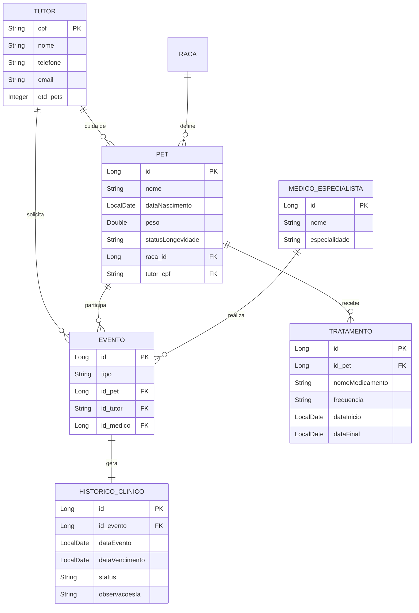

# Clyvo Vet - API de Longevidade Pet 🐾

Projeto desenvolvido para a Sprint 1 do Challenge (Disciplina: Java Advanced) pela FIAP. O Clyvo Vet é um Super App focado na gestão proativa da saúde e longevidade de animais de estimação.

## 👥 Integrantes
- **Vitória Rodrigues Martins** - RM565160
- **Augusto Bonomo Júnior** - RM565155
- **Thomas Fontes** - RM562254
- **Gabriel Maciel** - RM562795
- **Matheus Pereira Molina** - RM563399

## 🚀 Sobre o Projeto
Esta API fornece o núcleo inteligente do ecossistema Clyvo, integrando dados de pets com uma camada de **IA Preditiva** que sugere cuidados específicos baseados na raça e idade do animal.

## 📊 Modelo Entidade Relacionamento (MER)

## 🛠️ Tecnologias Utilizadas
- **Java 21**
- **Spring Boot 3.x**
- **Oracle Database** (Persistência Relacional)
- **Spring Data JPA**
- **Lombok** (Produtividade)
- **Bean Validation** (Integridade de Dados)
- **HATEOAS** (Navegabilidade REST)
- **Spring Cache** (Performance)
- **SpringDoc OpenAPI (Swagger)** (Documentação)

## 🏆 Requisitos "Advanced" Implementados
- **Camada de Serviço (Service Layer)**: Isolamento da lógica de negócio e cálculos de IA.
- **DTOs (Data Transfer Objects)**: Segurança e desacoplamento das entidades de banco.
- **Paginação e Ordenação**: Listagem otimizada de recursos (`/api/pets`).
- **HATEOAS**: Implementação de links dinâmicos seguindo o modelo de maturidade REST.
- **Tratamento de Erros Global**: Uso de `@RestControllerAdvice` para retornos padronizados.
- **Cache**: Otimização de performance em consultas de entidades de domínio.
- **Documentação Automática**: Interface interativa via Swagger UI.

## ⚙️ Como Rodar a Aplicação
1. **Banco de Dados**: 
   - Certifique-se de que o Oracle XE está rodando localmente.
   - O script de criação das tabelas e carga inicial está em `db_setup.sql`.
2. **Configuração**:
   - Ajuste o usuário e senha do seu Oracle no arquivo `src/main/resources/application.properties`.
3. **Execução**:
   - Rode o comando: `mvn spring-boot:run` ou execute via IDE.
4. **Acesso**:
   - A documentação interativa estará disponível em: `http://localhost:8080/swagger-ui.html`
