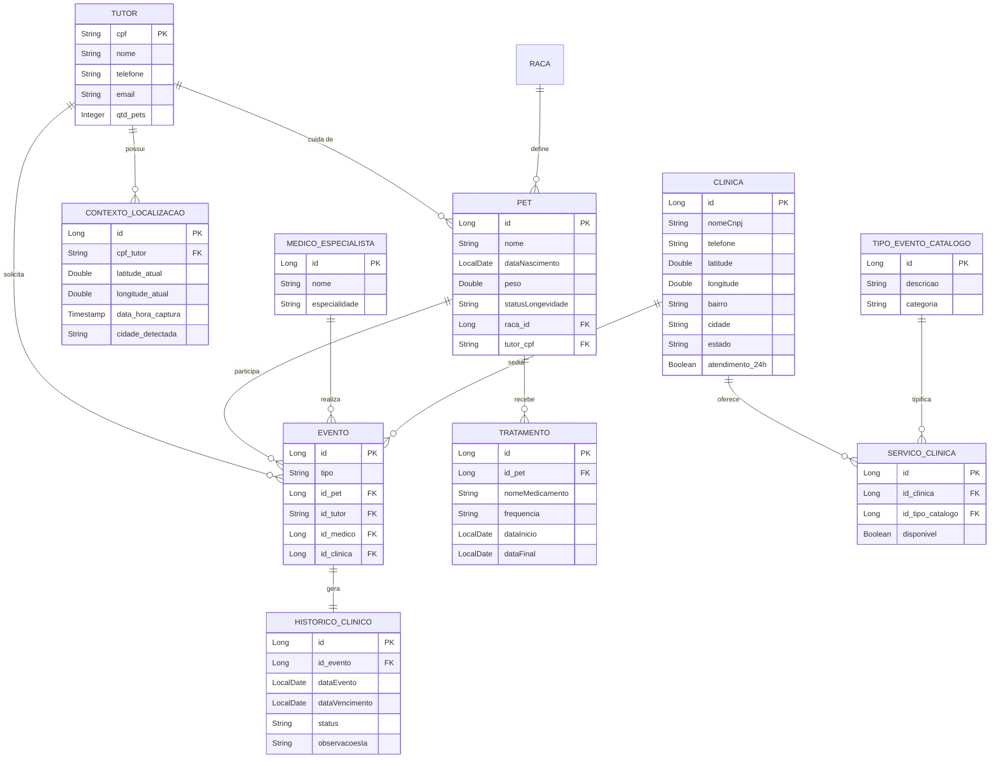

<div align="center">
  
  
  
  
</div>

<h1 align="center">🐾 Clyvo Vet - API Preditiva de Longevidade Pet</h1>

<p align="center">
  <strong>Projeto do 1º Challenge Sprint - Disciplina de Java Advanced (FIAP)</strong>
</p>

## 📖 Sobre o Projeto
O **Clyvo Vet** é uma plataforma inovadora baseada em análise de dados e Inteligência Artificial para medicina veterinária preventiva. Esta API RESTful fornece os recursos centrais para gerenciar Tutores, Pets, Clínicas e Tratamentos, além de gerar predições de saúde com base nas características raciais e de longevidade dos animais.

## 🚀 Tecnologias Utilizadas
- **Java 21** - Versão LTS mais recente com suporte avançado a Records e Virtual Threads.
- **Spring Boot 3.2+** - Framework base da aplicação.
- **Spring Data JPA & Hibernate** - Mapeamento Objeto-Relacional (ORM) estruturado.
- **Oracle 23c Free (Docker)** - Banco de dados de altíssimo desempenho com suporte nativo à arquitetura ARM64 (Apple Silicon).
- **Lombok** - Redução drástica de boilerplate code.
- **Jakarta Bean Validation** - Garantia de integridade de dados na entrada da API.
- **Spring HATEOAS** - Maturidade REST Nível 3 (Hypermedia as the Engine of Application State).

## 📊 Modelo Entidade Relacionamento (MER)


## 🏗️ Arquitetura e Padrões (Clean Architecture)
A aplicação adere estritamente às melhores práticas de Engenharia de Software exigidas pela FIAP:
1. **Padrão DTO:** Entidades de banco (`@Entity`) não são expostas na web. Toda a comunicação ocorre via objetos de transferência de dados (DTOs) estritamente validados.
2. **Injeção de Dependências por Construtor:** Abandono do problemático `@Autowired` em propriedades em favor da injeção explícita no construtor via `@RequiredArgsConstructor`.
3. **Controller-Service-Repository:** Lógica de negócios isolada 100% na camada Service, mantendo os Controllers limpos para tratar apenas requisições HTTP e roteamento.
4. **Tratamento Global de Exceções:** Configuração com `@RestControllerAdvice` para evitar stack traces vazando para o usuário e formatar erros RESTful (ex: `404 Not Found`, `400 Bad Request`).

## 📦 Como Rodar a Aplicação Localmente

### Pré-requisitos
- Docker e Docker Compose instalados.
- JDK 21 instalado e configurado no seu PATH.
- Maven 3.8+ instalado.

### Passo 1: Subir a Infraestrutura de Banco de Dados
A aplicação depende de um contêiner **Oracle 23c Free** localmente para persistência real. 
```bash
# Na raiz do projeto DevOps ou diretório configurado
docker compose up -d
```

### Passo 2: Inicializar a API
Com o banco rodando, inicie o Spring Boot:
```bash
mvn spring-boot:run
```
A API ficará disponível em: `http://localhost:8080/`

## 📡 Endpoints Principais (API)
A documentação completa (Collection) está na pasta `/Postman` na raiz do repositório. Principais rotas:

### 🧑‍💼 Tutores (`/api/tutores`)
- `POST` - Cadastrar novo Tutor.
- `GET /{cpf}` - Buscar detalhes do Tutor.
- `PUT /{cpf}` - Atualizar informações de contato.
- `DELETE /{cpf}` - Excluir Tutor.

### 🐕 Pets (`/api/pets`)
- `POST` - Registrar um novo Pet vinculado a um Tutor.
- `GET` - Listar todos os Pets (com Suporte a Paginação `?size=5&page=0`).
- `GET /{id}` - Buscar Pet detalhado com **HATEOAS** e Insights de Longevidade IA.

## 👥 Integrantes do Grupo
- **Vitória Rodrigues Martins** - RM565160
- **Augusto Bonomo Junior** - RM565155
- **Thomas Fontes** - RM562254
- **Gabriel Maciel** - RM562795
- **Matheus Pereira Molina** - RM563399
